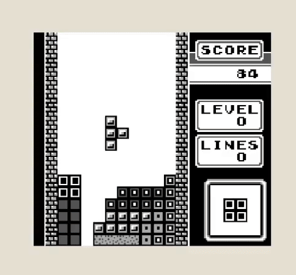

# 3DGB

A proof-of-concept Game Boy DMG emulator for Nintendo 3DS that renders games in 3D with **stereoscopic 3D** support,  
inspired by [3DSEN](https://geodstudio.net/).

The core emulator is [peanut_gb](https://github.com/deltabeard/Peanut-GB).  
This project implements an additional layer over the render pipeline that allows  
applying preconfigured metadata associated with individual tiles, such as color  
information and depth levels.

## Build

> Note: the repository is not very well organized at the moment.

### PC / Linux :

The only dependency required is [raylib](https://www.raylib.com/).  
To build the project, simply run `make`.

### Nintendo 3DS (homebrew) :

Requires the devkitPro / devkitARM toolchain for 3DS  
Build with `cd 3ds && make`, the output file is named `3dgb.3dsx`

Copy to your SD card, for example `sdmc:/3ds/3dgb.3dsx`  
ROMs and metadata files (`.meta`) must be placed in the SD card root `sdmc:/`

## Usage
See [PROFILES.md](PROFILES.md) for profile creation / metadata editing.

### PC / Linux :
Run `./3dgb [rom_path]`

* D-Pad -> arrow keys
* Start -> `P`
* A -> `Z`
* B -> `X`

### Nintendo 3DS :
Launch the app from the Homebrew Channel

* D-Pad -> D-Pad
* A -> A
* B -> B
* X -> increase screen size
* Y -> decrease screen size
* R -> increase depth
* L -> decrease depth